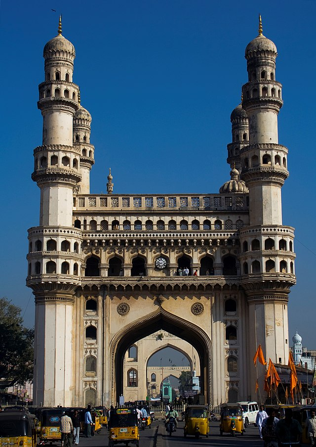

<DOCTYPE html>
    <html lang="eng">
    <head>
    <title>Home Page</title>
    <meta charset="UTF-8">
    <link rel="stylesheet" href="https://cdnjs.cloudflare.com/ajax/libs/font-awesome/4.7.0/css/font-awesome.min.css">  
    
    </head>
    <body style="background-color: rgb(236, 85, 69);">
    <header>
    

     
       

       <h1 align="center">HISTORICAL PLACES</h1>
    </header>
     
     
     
    
The many temples, forts, palaces and monuments in the country make up the historical places of India.
     These reflect the splendid heritage and culture of the country. 
    The historical places in India depict the stunning craftsmanship on the stone which can be seen in many temples and forts. 
    The Taj Mahal, Red Fort, Humayun's Tomb are famous historical monuments of the Mughal period. 
    Champaner, Dholavira and Nalanda are ancient archaeological sites.
     Glimpses of colonial architecture can be seen in cities such as Goa, Kolkata and Pondicherry. 
    The Great Living Chola Temples are another example of India's rich history.
     Konark, Mysore, Orchha, Hyderabad, Bijapur and Lucknow are few other cities that are of historical significance.
 
     
    <main>
    <section class="flex-container">
    

     
    <ul>
    <li><b><u>TAJMAHAL</u></b></li>
    <li>It was built by Mughal Emperor Shah Jahan</li>
    <li>Construction starting in 1632 AD and completed in 1642AD</li>
    </ul>
      
     
     
    <li><b><u>CHARMINAR</u></b></li>
    <li>The Charminar is a monument and mosque in Hyderabad, India. </li>
    <li>The structure was built in 1591AD</li>
    <li>It was built by Muhammad Quli Qutb Shahi </li>
    </ul>
     
    <ul>
    <li><b><u>RED FORT</u></b></li>
    <li>Red Fort, also called Lal Qalʿah, also spelled Lal Kila or Lal Qila, Mughal fort in Old Delhi, India. </li>
    <li>It was built by Shah Jahān in the mid-17th century and remains a major tourist attraction.</li>
    </ul>
      
     
    
    <ul>
    <li><b><u>JANTAR MANTAR</u></b></li>
    <li>The Jantar Mantar is a form of architecture built in 1724 by Maharaja Jai Singh II.</li>
    <li> He is the king of Jaipur. It was located in the heart of Delhi. </li>
    <li>It is considered a heritage astronomical observatory.</li>
    </ul>
    

    </section>
    

    

    <footer>
    <h3 align="center">contact us for more information:</h3>
     
     <a href="about us.html>about us</a>
     <a href="privacypolicy.html">privacy policy</a>
     <a  href="information.html">information</a>
     
 Some rights reserved

      
      
      
      
     
    </footer>
    </main>
    </body>
    </html>
